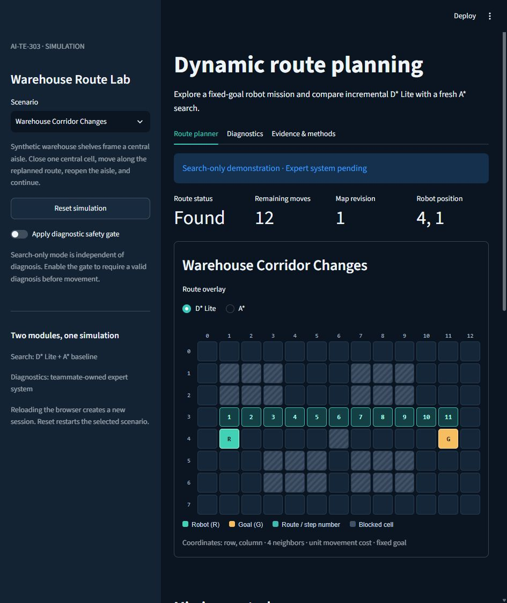
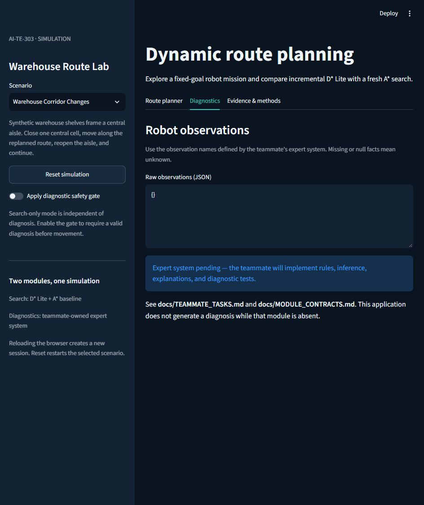

# Verified running evidence

Recorded source: [`9a724d6`](https://github.com/sar1p/AI-TE-303/commit/9a724d68378242e4587b7536bffe66889c9bc86e).
Recorded on October 9, 2026, using Python 3.12.14,
Streamlit 1.65.0, and pytest
9.1.1 on Windows 11. The exported
source worktrees were clean. The later method-label correction and evidence
publication do not change the measured search algorithms.

## What ran

- Fresh remote clone, fresh virtual environment, pinned dependency installation,
  and all five verification commands succeeded. The test output reports **90 passed**.
- [Main CI](https://github.com/sar1p/AI-TE-303/actions/runs/37922918084)
  passed the tests, all scenario replays, and a one-repetition benchmark on Ubuntu.
- Four named scenarios produced 22 actual planning records.
- The local benchmark completed 5 repetitions per scenario,
  producing 110 paired measurement rows.
- The live browser accepted an obstacle update, displayed the repaired route,
  and downloaded [session-evidence.json](session-evidence.json): route cost
  12, map revision 1.

These checks cover the lead-owned search, application, adapter, and export tools.
The actual expert-system engine is pending. Adapter test functions are synthetic
contract fixtures. A screen recording and the final combined rehearsal on the
teammate's laptop are still team deliverables.

## Measured comparison

Times are milliseconds. Each column is a median across independent repetitions;
repair totals and cumulative totals are calculated within each repetition before
aggregation, so phase medians need not add to the cumulative median.

| Scenario | D* Lite initial | A* initial | D* Lite repairs | A* repairs | D* Lite cumulative | A* cumulative |
|---|---:|---:|---:|---:|---:|---:|
| corridor-changes | 0.742 | 0.130 | 2.336 | 1.018 | 3.074 | 1.149 |
| movement-reuse | 4.903 | 0.948 | 3.085 | 7.054 | 7.984 | 8.009 |
| unreachable-recovery | 0.461 | 0.083 | 1.784 | 0.399 | 2.248 | 0.484 |
| widespread-changes | 29.313 | 6.164 | 4.696 | 12.313 | 34.015 | 18.471 |

D* Lite spends fewer processed states in these sessions but that does not always
reduce elapsed time. The corridor and unreachable fixtures favor A* overall.
The movement fixture shows less repair work with very similar cumulative timings.
The widespread fixture's initialization cost makes D* Lite slower cumulatively.
These small local measurements do not establish a universal speed advantage.

See [SEARCH_ALGORITHM.md](../SEARCH_ALGORITHM.md) for timing boundaries, counter
meanings, the fixed D* Lite-first execution order, and implementation limits.
The benchmark uses outer update-and-plan timings; the live UI reports only its
planning-call timing.

Text artifacts use LF line endings for reproducible checksums; recorded values
and screenshot bytes are unchanged.

## Files

- [replay.json](replay.json): scenario inputs and computed route histories.
- [benchmark-raw.csv](benchmark-raw.csv): every measured pair, map, path, and event.
- [benchmark-summary.json](benchmark-summary.json): metadata, inputs, and medians.
- [clean-clone.json](clean-clone.json): independent reproduction command outcomes.
- [clean-clone-tests.txt](clean-clone-tests.txt): actual test output.
- [ci-validation.txt](ci-validation.txt): selected actual CI log lines.
- [session-evidence.json](session-evidence.json): actual browser download.
- [SHA256SUMS.txt](SHA256SUMS.txt): checksums for the committed evidence files.

The robot is at row 4, column 1. The goal remains row 4, column 11. Closing the
central aisle changes the route from 10 to 12 moves while the map revision rises
to one. This screenshot was captured from the running application.

No diagnosis is claimed for the pending teammate module.
